1. Make VM 
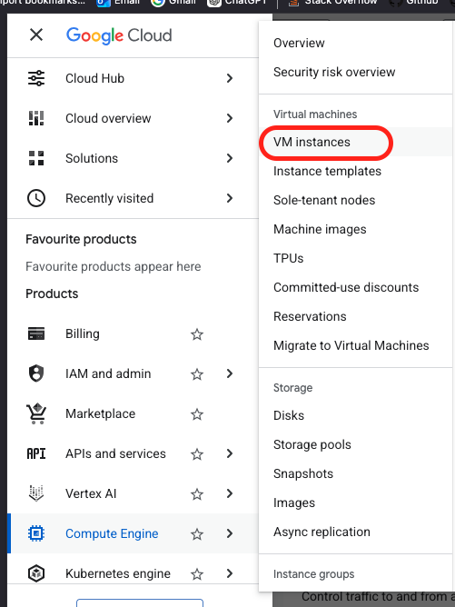

2. select nvidia t4 GPU
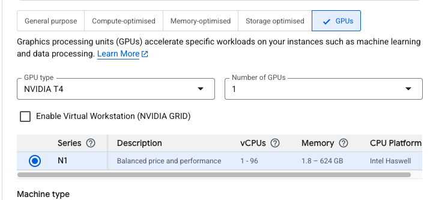
3. Set the machine type to 8 vCPU and 30GB RAM, Set the VM provisioning model to spot, select Gracefully shut down the VM
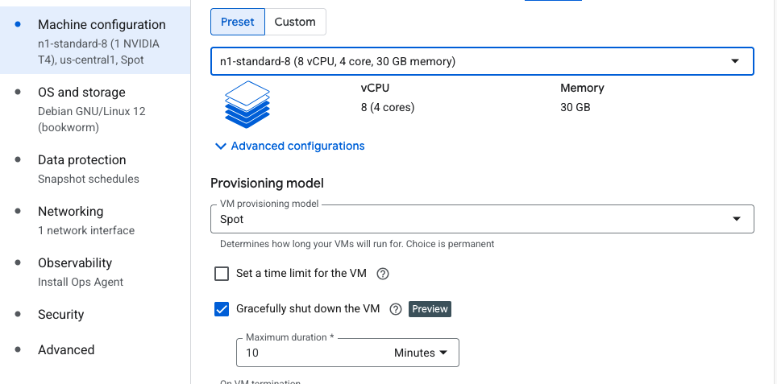
4. set OS to CUDA w 500gb harddrive,
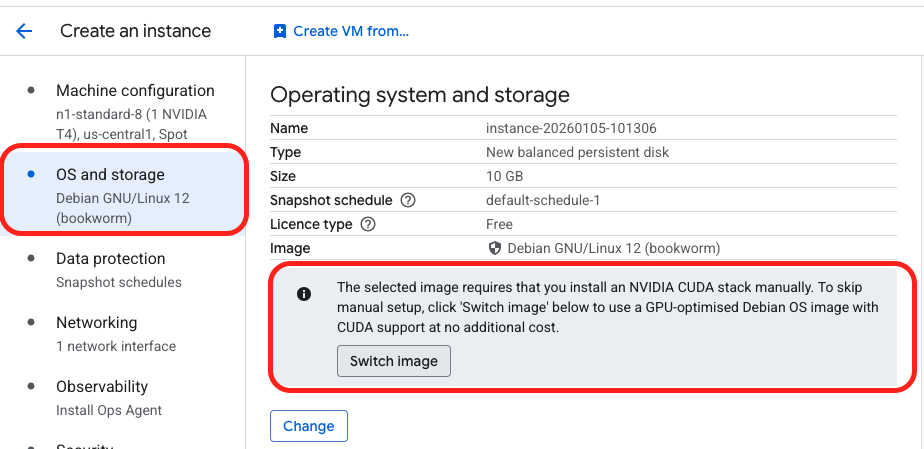
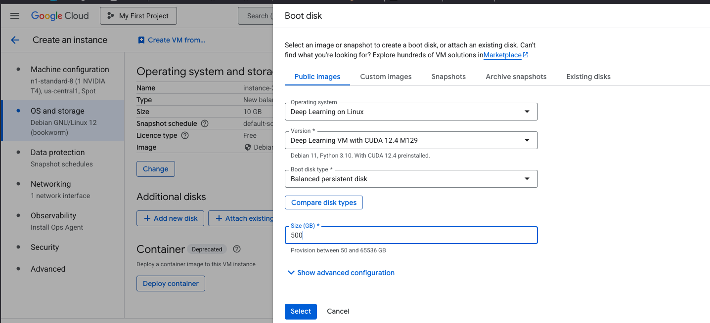
5. Create the instance

6. create a firewall rule at VPC Network -> Firewall to turn http traffic on
    Targets: All instances in the network
    Source IPv4 ranges: *enter ip*/32 *or 0.0.0.0/0 for all ips*
    Specified protocols and ports: tcp:PORT_NUMBER
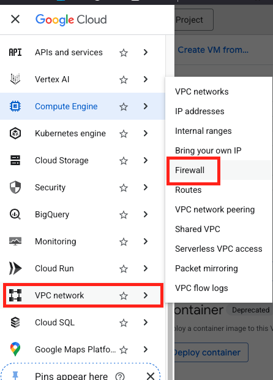
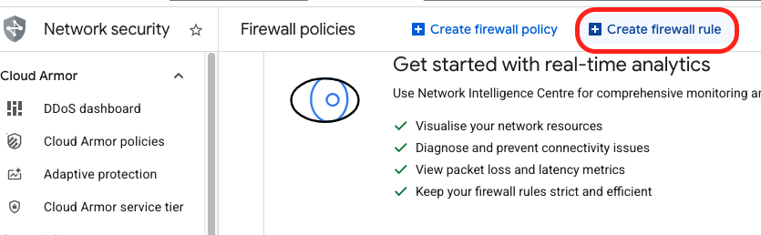
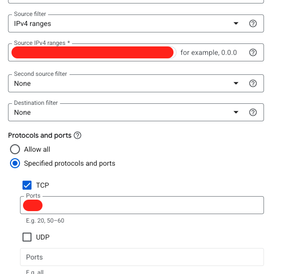
- make sure http traffic is allowed as well
- replace PORT_NUMBER with your port number
- remember to include the /32 after your ip
7. Create an ssh key locally
```
ssh-keygen -t rsa -f ~/.ssh/your_gcp_ssh_key -C your_gmail@gmail.com
```
8. copy your ssh key
`cat ~/.ssh/your_gcp_ssh_key.pub`
copy the whole value
9. place that vale on your instance at Compute Engine -> VM Instances * Select Instance * edit -> ssh keys -> Add item *paste your ssh key* -> Save

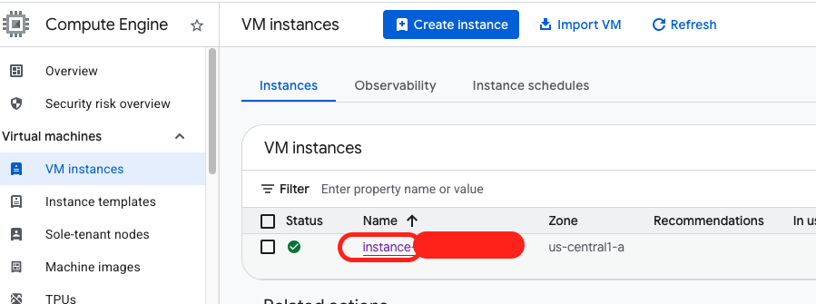
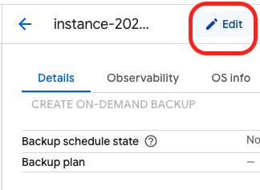
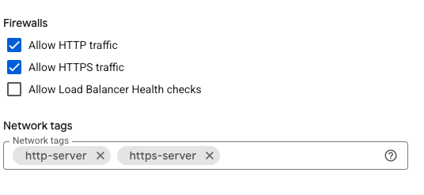
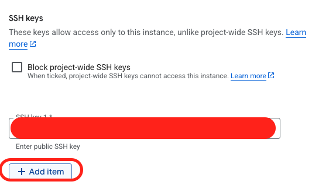

10. Optional: Set external IP to static address at VPC Network -> IP Addresses

11. You can now ssh to your VM in the terminal by running `ssh -i ~/.ssh/your_gcp_ssh_key your_gmail_username@instance_external_ip`
- your_gmail_username does not include @gmail.com

Where to find your external ip address

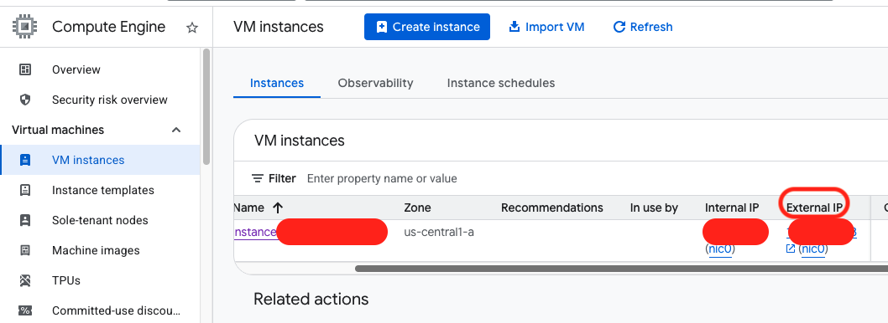

# TODO: instructions on getting the VM to stop automatically after being unused for 1 hr

12. git clone https://github.com/samgermain/comfyui-google-cloud-setup
13. cd comfyui-google-cloud-setup
14. Copy .ENV_template to .ENV and add your values for HF_TOKEN, CIVITAI_API_KEY, SERVER, PORT
15. run 
- ./install-driver.sh
- ./install-comfyui.sh
- ./install-models.sh // DOWNLOADS A LOT OF MODELS
// TODO: - ./install-extensions.sh
- ./download-workflows.sh
- ./create-aliases.sh
- ./run-comfyui.sh